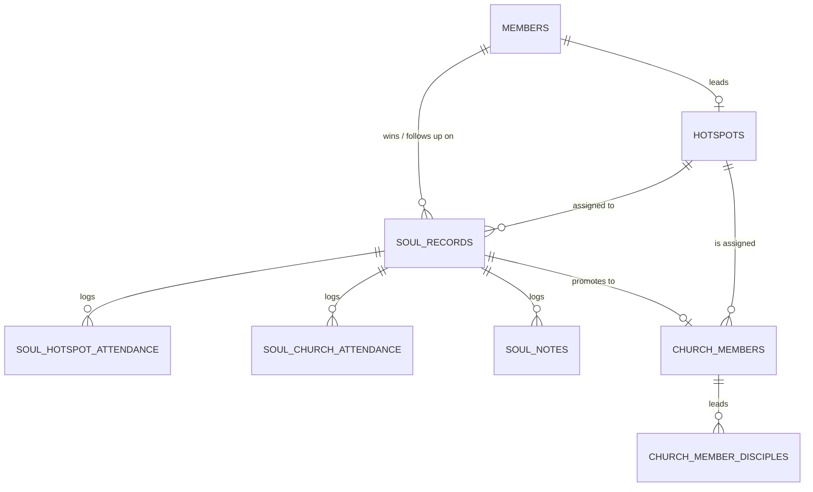

# The Tracker's Database

The tracker is backed by a real **SQLite** database — not a proprietary format. This document is the reference for the schema and the day-to-day workflows around it.

## Why SQLite, and how it runs with no server

[sql.js](https://sql.js.org) compiles SQLite itself to WebAssembly, so the *entire database engine* runs inside the visitor's browser. That means:

- The database is a genuine `.sqlite` file — inspectable in [DB Browser for SQLite](https://sqlitebrowser.org/), queryable with any SQLite client, importable into Excel or Python/pandas.
- No server, no database host, no monthly bill, no sign-up. GitHub Pages serves the static files; the browser does the rest.
- It works offline once loaded, since `vendor/sqljs/` ships the WASM engine directly — nothing is fetched from a CDN.

## Schema



| Table | Purpose |
|---|---|
| `members` | Current members roster — feeds every "who" dropdown. |
| `hotspots` | Hotspot families and their leader. |
| `soul_records` | One row per soul won — the core tracking record. Includes `archived`/`archive_reason_category`/`archive_reason_text`/`archived_at` (see Archive, §4e of the technical document). |
| `soul_hotspot_attendance` | Open-ended checklist of hotspot-attendance dates per soul. |
| `soul_church_attendance` | Open-ended checklist of church-attendance dates per soul. |
| `soul_notes` | Append-only follow-up notes log per soul. |
| `church_members` | The membership report — populated automatically at Service Team stage. Same archive columns as `soul_records`. |
| `church_member_disciples` | Many-to-many link: who each hotspot leader disciples, picked from `church_members` itself. |
| `settings` | Follow-Up Radar thresholds, based on days since the last note (`noteWarnDays`, `noteDangerDays`). |

Full column-level definitions, constraints, and indexes: [`db/schema.sql`](../db/schema.sql).

## Everyday workflows

### Just using the app
You don't need to touch anything in `db/` to use the tracker day to day — the app reads and writes the database for you. `db/` and `data/tracker.db` only matter when you want to change what a **fresh install** starts with, or when you want a scriptable way to build the database outside the browser.

### Backing up / handing off data between people
Use the **Members & Settings → Database** panel in the app:
- **Export database (.sqlite)** — downloads the live database as a real `.sqlite` file.
- **Import database (.sqlite)** — loads someone else's exported file into your browser.

A JSON export/import is also available for a human-readable alternative (e.g. for diffing two backups in a text editor).

### Changing what ships with a fresh install
1. Edit [`db/seed.sql`](../db/seed.sql) — add, remove, or change the `INSERT` statements (members, hotspots, soul records, etc.).
2. Rebuild the database file:
   ```
   python3 db/build_db.py
   ```
3. Commit the regenerated `data/tracker.db` along with your `seed.sql` change. Anyone who clears their browser data, or opens the tracker for the first time, will now start from this data.

### Changing the schema itself
1. Edit [`db/schema.sql`](../db/schema.sql).
2. Mirror the same change in the `SCHEMA_SQL` constant near the top of `js/store.js` (this is the copy the app uses to rebuild the database in-browser on every save — kept in sync manually, deliberately, so the app has zero extra network calls).
3. Update the corresponding read/write mapping in `js/store.js`'s `_hydrateFromDb()` and `_buildDbBinary()` functions.
4. Rebuild with `python3 db/build_db.py` and commit the result.

### Querying the data directly
Open `data/tracker.db` (or any exported `.sqlite` backup) in DB Browser for SQLite, or from a terminal with the `sqlite3` CLI:
```
sqlite3 data/tracker.db "select name, plug_in_stage from soul_records;"
```
This is useful for one-off reports the in-app dashboard doesn't cover yet — e.g. souls won per month, or per outreach team.

## Limitations of this version

- Each browser holds its own copy — there is no automatic real-time sync between team members' devices. See `docs/TECHNICAL_DOCUMENT.md` §8 for the upgrade path to a shared, always-online database (Supabase, Turso, or Firebase) if the campus outgrows the export/import workflow.
- `localStorage` has a per-site size ceiling (typically 5–10MB depending on the browser) — comfortably enough for thousands of soul records, but worth knowing if the campus grows very large.
