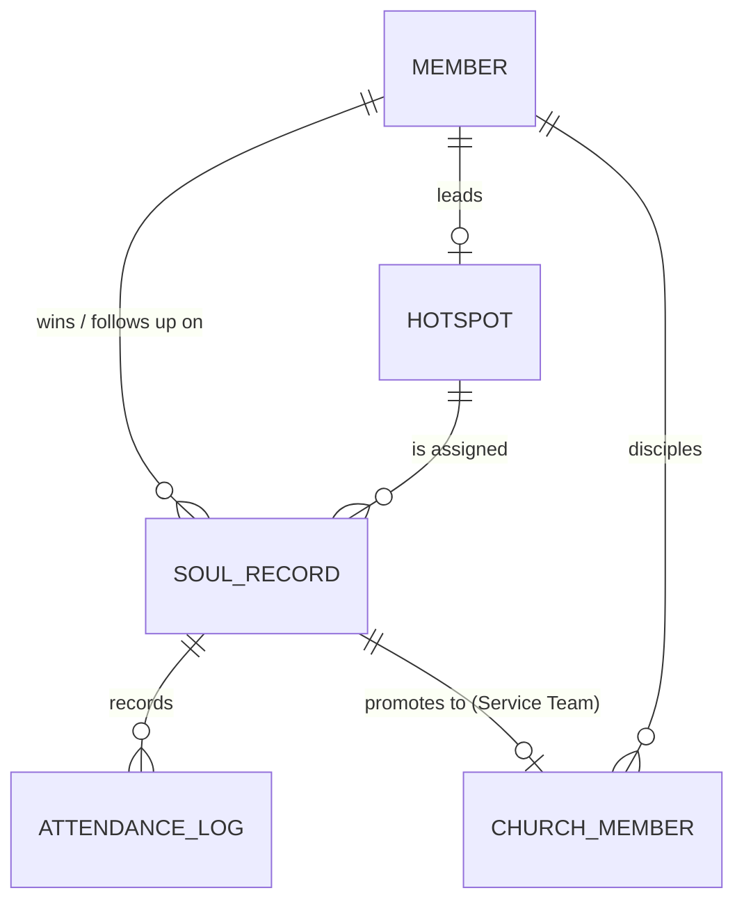

# TGC Rongai Campus Tracker
### Technical Document — v1.0

**The Go Church, Rongai Campus** · Soul Winning & Plug-In Tracking Platform

---

## 1. Purpose

The Rongai Campus exists to reach the lost and disciple them into fully devoted members of the church family. The single biggest operational risk in that mission is a **soul that gets won but never gets plugged in** — someone who prays a prayer, gets a phone number taken, and is never seen again.

This platform exists to close that gap. It gives the campus one shared source of truth for:

- Every soul won during outreach, who won them, and where they are in their journey.
- A living **Follow-Up Radar** that flags anyone going cold before they're lost.
- A **Church Member Report** for everyone who has reached the level of commitment the campus recognizes as membership: serving.

Everything in this document maps directly to a screen in the app that ships alongside it.

---

## 2. Core Concept: "Plug In"

"Plug In" is the campus's own language for spiritual and relational integration. The tracker is built around a single required field, **Plug-In Stage**, that every soul-won record carries:

| Order | Stage | Meaning | What changes in the system |
|---|---|---|---|
| 1 | **Guest** | Just gave their life to Christ (formerly labelled "New Soul"). | Appears on the Follow-Up Radar. No hotspot yet. |
| 2 | **Attends Hotspot** | Has a hotspot (a home-sized family within the church) and a hotspot leader following up on them. | Hotspot attendance checklist becomes active. |
| 3 | **Attends Get Set** | Enrolled in Get Set — the campus's foundations-of-faith class. | Still tracked on the Radar; church + hotspot attendance both tracked. |
| 4 | **Service Team** | Now serving under a department with a department leader. This is the campus's bar for "member." | **Record is promoted out of the Soul Winning table into the Church Member Report** and drops off the Follow-Up Radar automatically. |

The stage is a strict progression used for reporting, but the interface never blocks someone from being moved forward or back a stage — pastoral judgment always overrides the checklist.

---

## 3. Data Model

### 3.1 Entity relationships



### 3.2 Soul Winning Record

The primary record. One row per soul won.

| Field | Type | Notes |
|---|---|---|
| Name | text | |
| Won By | Church Member reference, or "Sunday Guest" | Who led them to Christ — searched from the Church Member Report (a long list, hence the search box), or **"Sunday Guest"** for someone not met during outreach/soul-winning (invited to a service, or came via a social media post). Records saved before this field pulled from Church Members still display and attribute correctly via a legacy fallback to the old Hotspot Leaders roster. |
| Date of Outreach | date | |
| Mobile Number | phone | |
| Status of Winning | enum | `Already Born Again` · `Rededicated Their Life` · `New Soul` |
| Context | text | Free text — something memorable, e.g. where they stay, how they were met |
| Follow-Up Member | member reference | Who is responsible for staying in touch |
| Hotspot | hotspot reference | Which hotspot they're assigned to |
| Plug-In Stage | enum | See §2 |
| Hotspot Attendance | date checklist | Custom, open-ended list of dates they attended their hotspot |
| Church Attendance | date checklist | Custom, open-ended list of dates they attended a service |
| Notes | text, append-only log | Where the follow-up member logs how the last interaction went |

Both checklists are **open-ended** — the follow-up member adds a new date each time contact happens, rather than choosing from a fixed calendar, since outreach and hotspot schedules vary week to week.

### 3.3 Church Member Report

A soul is promoted here the moment their Plug-In Stage is set to **Service Team**. This is a separate report because it represents a different relationship with the church — membership rather than follow-up.

| Field | Type | Notes |
|---|---|---|
| Name | text | Carried over from the soul record |
| Residential Address | text | Collected once someone reaches this stage |
| Mobile Number | phone | |
| Hotspot | hotspot reference | |
| Hotspot Leader / Discipler | text | Shows as **"Hotspot Leader"** normally. If this member *is themselves* a hotspot leader, the same field is relabelled **"Discipler"** and holds the name of the member discipling them. |
| Notes | text | Ongoing relational notes, distinct from the follow-up notes above |
| Disciples | multi-select checklist | Chosen from the Church Member Report itself (not free text) — a "Manage disciples" checklist lists every other church member with a checkbox, so a leader's disciples are always real, existing records. |

### 3.4 Supporting lists

- **Hotspot Leaders** — the current roster of active members who can be assigned as "Won By," "Follow-Up Member," "Hotspot Leader," or "Discipler." (Labelled "Hotspot Leaders" in the app since that's the role every person in this list ultimately fills.)
- **Hotspots** — the list of hotspot families, each with a designated leader and a **capacity**. The campus's target is **6 members per hotspot**, with a hard ceiling of **10** — the admin panel shows each hotspot's current occupancy (e.g. "6 / 10") so leaders know when a hotspot is approaching capacity and a new one may be needed.

---

## 4. Feature: Follow-Up Radar (Dashboard)

The dashboard is the operational heart of the tracker, built around three questions:

**(a) Who haven't we contacted recently?** The **"Not Contacted Recently"** table lists everyone whose *last logged note* is 3+ days old (configurable), or who has never had a note logged at all — using the note log as the reference point, not attendance. This is deliberate: attendance tells you whether someone showed up, but the note log tells you whether a real human being has actually reached out to them lately, which is the leading indicator that matters for retention.

- *Days since last contact* = today − the date of the most recent entry in that soul's Notes log. No notes at all is flagged as **"Never contacted."**
- A configurable threshold (default **3 days**) colors a row amber; **7 days** colors it red. Both are adjustable from Members & Settings.

**(b) How many souls have actually attended hotspot / church?** Two large, clickable stat cards show the count of souls (still in follow-up) who have at least one hotspot-attendance date and at least one church-attendance date logged. Clicking either count opens a floating list — Name, Follow-up member, Mobile number, and their most recent note — so a leader can immediately see and act on exactly who's behind that number.

**(c) All souls won, by date.** A full table of every soul currently in follow-up, sorted most-recently-won first, carrying the same fields as the rest of the Radar (Plug-In stage, days since church, days since hotspot, follow-up member, hotspot leader, mobile) so it doubles as a chronological outreach log.

**(d) Who still needs a hotspot?** Hotspots are assigned based on where someone stays — the **"Needs a Hotspot"** table lists everyone still active in follow-up with no hotspot assigned, so the team can see how many people still need that follow-up call to find out where they live and get them placed. The Hotspot dropdown (on both the Soul Won form and the Church Member form) includes an explicit **"(No hotspot yet)"** option, so leaving someone unassigned is a deliberate, visible choice rather than silently defaulting to whichever hotspot happens to be listed first.

**Scope (all four reports):** every Soul Winning Record whose Plug-In Stage is *not* Service Team (i.e., everyone not yet promoted to the Church Member Report).

The Plug-In stage is shown both as the visual meter and as its text label (e.g. "New Soul") everywhere on the dashboard, so the stage is unambiguous at a glance without needing to hover.

**Notes field:** each row's "Notes" action opens the same running log used to calculate report (a) — a follow-up member records how their last contact went (call, visit, no answer, etc.), timestamped automatically. This is the same `Notes` field defined on the Soul Winning Record in §3.2 — the dashboard is a view onto it, not a separate store.

---

## 4a. Feature: Dashboard (Custom Reports)

A separate tab from the Follow-Up Radar, built for trend and workload questions rather than day-to-day follow-up. Three reports are built in, plus a custom report builder; every chart offers a Line/Bar toggle and clicking a bar or marker opens a floating drill-down card listing the actual people behind that number (Name, days since last contact, follow-up person, mobile, last note).

1. **Souls Won Over Time** — split into **New Souls Won** (Status of Winning = New Soul or Rededicated Their Life — a real decision moment) vs **Already Born Again** (already saved, but without a church home — encouraged elsewhere to plug into their own church faithfully). The two stack/overlay to show **Total People Reached**. Toggle between month-on-month and year-on-year.
2. **Top Person Winning Souls** — soul count by "Won By," filterable by month and/or year, sorted highest first.
3. **Souls Won by Follow-Up Person** — how many people each Hotspot Leader currently has open to follow up with (this one *does* exclude Service Team, since those souls no longer need active follow-up).
4. **Souls Won by Hotspot, Per Week** — a Monday–Sunday week picker (any date snaps to its containing week), one bar/line per hotspot, with a dashed **target line** (default 10 souls/hotspot/week, adjustable in Members & Settings) so a leader can see at a glance who's above or below target. Attribution follows the *winner's own hotspot* (their Church Member record's hotspot assignment) — **souls won by a "Sunday Guest" are excluded**, since no hotspot's outreach effort won them; they still count everywhere else (Report 1, Report 2, the custom builder).
5. **Build a Custom Report** — group every soul won by month, year, hotspot, Plug-In stage, status, Won By, or Follow-Up member, with the same month/year filters and chart-type toggle.

**Mid-year adoption:** a campus starting to use this tracker partway through the year almost certainly has souls they already won before switching over. **"Previously Recorded Souls Won"** (Members & Settings) is a single carried-over number added on top of everything logged in the system to give an accurate **Total Souls Won (all-time)**, shown above Report 1. Since that carried-over number has no outreach date, it's deliberately excluded from the month/year breakdown charts — a note under the chart controls says so explicitly.

**Why soul records are never deleted:** Earlier versions removed a soul's record the moment they reached Service Team, so historical "souls won" reporting would have quietly undercounted anyone who progressed all the way through. Soul records are now kept permanently — the Follow-Up Radar (§4) simply filters to non-Service-Team souls, while the Dashboard's historical reports use the full, unfiltered history.

## 4b. Timezone, Undo, Safety Confirms, and Keyboard Accessibility

- **Timezone:** the app's timezone (default `Africa/Nairobi`) is stored in `localStorage` (a device preference, separate from the SQLite database) and selectable in Members & Settings. Every "today"/"days since" calculation and every displayed timestamp routes through `Intl.DateTimeFormat` against this zone, so results stay consistent regardless of which device or location someone opens the tracker from.
- **Undo:** the Store keeps an in-memory (not persisted across reloads), capped stack of up to 10 prior states, snapshotted immediately before any edit, delete, or full-data import. A "↺ Undo last change" button appears in the top bar whenever there's something to revert.
- **Safety confirms:** saving an edit to an existing soul or church member, overwriting a disciples list, changing Radar thresholds or the weekly target, replacing a carried-over year's count, and importing a JSON/SQLite backup (which replaces all data) all ask for confirmation first.
- **Keyboard accessibility:** pressing `Escape` anywhere closes the open modal/overlay.

## 4c. Cloud Sync (Supabase)

The tracker syncs to a Supabase project (Postgres + auto-generated REST API) so changes on one device reach every other device. On load, the app tries Supabase first. The local SQLite backup always updates immediately and synchronously on every change, regardless of the network — the cloud push is debounced 5 seconds (rapid edits collapse into one sync) and is a **safe incremental upsert**: it only adds/updates rows present in the current local data, plus deletes for whatever was explicitly deleted in the app, never a wipe-and-replace — so a save can't erase data that only exists in the cloud so far (e.g. from another device that hasn't synced here yet). Deliberate, user-confirmed "replace everything" actions (Reset to demo data, Import, and the manual "Push local data to cloud now" button) are the exception — they do a full wipe-and-reinsert, exactly as their confirmation dialogs say. If Supabase is unreachable, the app falls back to the last-known-good local copy, and any unsynced deletes retry automatically on the next successful sync.

Full setup steps, the security tradeoffs of the current no-login/open-anon-key configuration, and what to verify yourself (this integration could not be tested against a live Supabase project in the environment it was built in) are in [`supabase/CLOUD_SYNC.md`](../supabase/CLOUD_SYNC.md) — **read this before relying on it for real outreach data.**

## 4d. Branding & Theming

Any church using this tracker can make it their own from Members & Settings → Branding:

- **Logo:** upload a PNG/JPG/WebP/SVG to replace the default Go Church mark in the top bar. It's stored as a data URL inside the synced settings, so it follows the campus across devices (via Cloud Sync, §4c) the same way every other setting does. A "Reset to The Go Church logo" button reverts to the bundled default. The favicon updates too — uploaded logos are redrawn onto a small square canvas first (centered, padded, white background) so odd aspect ratios or whitespace-heavy source images still make a legible favicon.
- **Color scheme:** four built-in presets — **Blue & Purple** (default), **Sky & Yellow** (the original warm/energetic look), **Royal Violet**, and **Slate Monochrome** — selectable as swatches. Presets are just different values for the same CSS custom properties already used everywhere in `css/styles.css` (`--blue`, `--yellow`, `--navy`, etc.), applied at runtime via `document.documentElement.style.setProperty()` in `js/theme.js` — no separate stylesheets to maintain.
- **Logo contrast:** the top-bar logo always sits inside a solid white rounded badge with its own shadow, independent of whichever color preset or branding is active, so it never gets lost against a bold gradient background.

## 4f. Login & Roles

Three user types: **Super Admin**, **Branch Admin**, **Hotspot Leader**. Only Super Admins can reach Members & Settings — the tab is hidden for everyone else, and `renderAdmin()` refuses to render its contents even if reached directly, as a defense-in-depth check. Users are managed entirely by Super Admins (Members & Settings → Users): create, edit (including changing type or password), and delete — with one rule enforced everywhere: **the last remaining Super Admin can't be deleted**, so the tracker can never be locked out.

Passwords are SHA-256 hashed before being stored, so they're not sitting around as plaintext. **This is a courtesy, not real security** — see the security note in `supabase/CLOUD_SYNC.md`. Because this whole app runs on an open Supabase anon key, the login screen is a UI-level gate (stops casual/accidental access, gives every action a named owner) and cannot stop someone who calls the Supabase API directly with that key. Real protection against a deliberate bad actor requires Supabase Auth, a separate project.

A default account ships and self-heals: if the `users` list is ever empty (fresh install, a project that hasn't run the users migration, or an emptied table), the app seeds one Super Admin — Name `Marumo`, Password `tgcrongai2026` — so there's always a way in. Change this password after first login.

## 4e. Archive

Sometimes someone needs to come off the active dashboards without being deleted — they relocated, were handed off to another branch/pastor, went quiet, etc. **Archive** (available from a soul's or church member's card, or directly from their table row) does exactly that: it flags the record as archived and removes it from the Follow-Up Radar (souls) or Church Member Report (members), while keeping every field, note, and attendance record fully intact. It can be reversed any time via "Unarchive."

Archiving asks for two things:
- **Archive reason category** — a dropdown, managed in Members & Settings → Archive Reason Categories (defaults: Relocated, Assigned to Another Branch/Pastor, Lost Contact, Personal Request, Other).
- **Archive reason** — free text for the specific detail (e.g. "Moved to Nakuru, now under Pastor John").

The **Archive tab** has:
- Two tables — **Archived Souls** (Name, Context, Archive reason category, Archive reason, **Last Physical Engagement**) and **Archived Church Members** (Name, Notes, Archive reason category, Archive reason, Hotspot) — each with an Unarchive action.
- **Last Physical Engagement** is the more recent of a soul's church or hotspot attendance, labelled with which one it was and formatted plainly (e.g. "5 July 2026 - Sunday Church").
- Two time-series reports — **Archived Souls Over Time** and **Archived Church Members Over Time** — with the same month/year toggle, Line/Bar chart type, and click-to-drill-down (showing Name, Archive reason category, Archive reason) used throughout the Dashboard tab.

Archived souls are excluded from every Follow-Up Radar report (§4) since they're no longer being actively followed up — but they're **not** excluded from the Dashboard's historical reports (§4a) like Souls Won Over Time or Top Person Winning Souls, since archiving doesn't erase the fact that they were won.

## 5. Feature: Soul Winning Records

A filterable, searchable table of every soul ever won, with:

- Add / edit form covering every field in §3.2, plus a **"Delete this record"** button inside the modal itself (in addition to the row-level Delete button) — deleting fully removes a soul from every Dashboard count, in case it was logged by mistake.
- Inline "Add attendance" action on both checklists — one tap logs today's date.
- Follow-up notes can be deleted individually (not just added), and a disclaimer — **"Do not log a note if you have not been able to reach the soul"** — is shown directly above the notes log.
- Filter by Plug-In Stage, Hotspot, Won By, or Follow-Up Member — useful for a hotspot leader who only wants to see their own people, or a pastor reviewing one outreach team's results.
- Changing Plug-In Stage to **Service Team** triggers the promotion described in §2 and §3.3; the record stays in this table for historical reporting (§4a) and a new Church Member entry is created (pre-filled with name, mobile number and hotspot; address, discipling details, and notes are then completed by whoever processes the transition, or a Church Member can now be added directly — see §6).

---

## 6. Feature: Church Member Report

A second table, structurally separate from Soul Winning Records, listing everyone who has reached the Service Team stage — or anyone added directly via **"+ Add Church Member"** (for people joining straight into membership rather than through the outreach funnel). This is the campus's live membership register — the fields here (§3.3) are the ones relevant to an established member's ongoing life in the church, not their initial follow-up.

Residential address is captured and editable in each member's card (Open / Edit modal) but deliberately left out of the summary table itself, to keep the table scannable — the same pattern as the Soul Winning Records modal holding more detail than its row.

---

## 7. Design System

The visual language draws on the campus's own energy — bright, direct, evangelistic — rather than a generic dashboard look.

| Token | Value | Use |
|---|---|---|
| `--sky` | `#EAF6FF` | Page background |
| `--sky-mid` | `#BFE3FA` | Cards, table stripes |
| `--blue` | `#1F7AC7` | Primary actions, active states |
| `--navy` | `#0F3352` | Headings, primary text |
| `--yellow` | `#FFC93C` | Accent, highlights, "plugged in" badges |
| `--gold` | `#E8960C` | Warning threshold on the Radar |
| `--red-flag` | `#E2544B` | Critical threshold on the Radar |

**Type:** Sora for display/headings (bold, geometric — reads as energetic and modern), Inter for body and tabular data (clean and highly legible at small sizes for dense tables).

**Signature element:** the **Plug-In Meter** — a four-node connector graphic (styled after a literal plug being pushed into a socket) that visualizes New Soul → Hotspot → Get Set → Service Team. It appears on every soul's record and animates one notch forward whenever their stage advances, making the campus's own language for discipleship a literal, visible mechanic in the product rather than just a dropdown label.

---

## 8. Architecture

The app is a **static, client-side single-page app** — plain HTML/CSS/JavaScript with no build step and no server — so it can be hosted for free on **GitHub Pages** and opened by any team member with just a browser. Its data layer is a **real SQLite database**, run entirely in the browser via [sql.js](https://sql.js.org) (SQLite compiled to WebAssembly), vendored locally so nothing is fetched from a CDN at runtime.

```
tgc-tracker/
├── index.html            # App shell: nav, dashboard, tables, modals
├── css/
│   └── styles.css        # Design tokens + layout
├── js/
│   ├── store.js           # Data layer: SQLite (sql.js) load/save, promotion logic
│   ├── render.js           # Rendering for each view
│   └── app.js                # Event wiring, app bootstrap
├── vendor/sqljs/
│   ├── sql-wasm.js          # sql.js library (vendored, no CDN dependency)
│   └── sql-wasm.wasm        # SQLite compiled to WebAssembly
├── data/
│   └── tracker.db             # The shipped database — what a fresh clone starts with
├── db/
│   ├── schema.sql               # Table definitions (source of truth for the schema)
│   ├── seed.sql                  # Starting data — edit this to change what ships
│   └── build_db.py                 # Compiles schema.sql + seed.sql → data/tracker.db
└── docs/
    ├── TECHNICAL_DOCUMENT.md
    └── DATABASE.md
```

**How the database loads and saves:**

1. **First run in a browser:** the app fetches `data/tracker.db` (a real SQLite file, built from `db/schema.sql` + `db/seed.sql`), opens it with sql.js, and reads every table into memory.
2. **Every change** (adding a soul record, logging an attendance date, adding a note, editing a church member) rebuilds a fresh SQLite database from the current in-memory data and caches the resulting bytes in `localStorage`. That cache is what loads on the next visit, so the browser always has a real, valid `.sqlite` file backing it — not just a JSON blob.
3. **Export Database** (Members & Settings tab) downloads that live `.sqlite` file at any time — open it directly in [DB Browser for SQLite](https://sqlitebrowser.org/), query it, or hand it to someone else's copy of the tracker via **Import Database**.

This gives the campus an actual, portable, query-able database file — not just an in-app format — while keeping the whole platform free to host and dependency-free at runtime.

- **Team workflow (current version):** because each browser holds its own working copy, the recommended pattern is the same as any offline-first tool — one designated admin exports the `.sqlite` (or `.json`) file after each outreach or leaders' meeting and shares it, and anyone else imports it before making changes. See `docs/DATABASE.md` for exactly how to inspect, edit, or regenerate the database file.
- **Multi-device / real-time sync (future upgrade path):** because the data layer (`store.js`) is isolated behind a small set of functions (`load`, `save`, `addSoulRecord`, etc.) that the rest of the app calls, swapping the local SQLite copy for a hosted database — Supabase (Postgres), Turso (hosted SQLite), or Firebase — only requires rewriting `store.js`; `render.js` and `app.js` do not need to change. This is the natural next step once the campus outgrows a single-device-at-a-time workflow.

---

## 9. Hosting on GitHub Pages

Because the database (§8) is a static file that ships inside the project and runs entirely in the visitor's browser, hosting the "platform with the database attached, running fully" is exactly the same as hosting the site — there is nothing extra to stand up.

1. Create a new GitHub repository, e.g. `tgc-rongai-tracker`.
2. Upload the contents of this project (or `git push`) so `index.html` sits at the repository root — make sure `vendor/`, `data/`, and `db/` come along with it.
3. In the repository, go to **Settings → Pages**.
4. Under **Build and deployment**, set **Source** to `Deploy from a branch`, branch `main`, folder `/ (root)`.
5. Save. GitHub will publish the site at `https://<your-username>.github.io/tgc-rongai-tracker/` within a minute or two.
6. Share that link with the team. The first time anyone opens it, their browser downloads `data/tracker.db` and everything runs from there — no server, no signup, no separate database to host.

No build tools, npm install, or server are required at any point. Because data still lives per-browser (§8), use **Export Database** / **Import Database** to keep the team on the same copy — or see `docs/DATABASE.md` for how to update the shipped `data/tracker.db` itself so every fresh visitor starts from the latest data.

---

## 10. Roles & Permissions (current version)

The v1.0 app does not enforce login-based permissions — it is designed for a small, trusted campus team sharing one exported dataset. Field-level responsibility is instead enforced by convention, matching real campus roles:

- **Outreach members** log new Soul Winning Records after an outreach.
- **Follow-up members** update the Notes field and attendance checklists.
- **Hotspot leaders** update hotspot attendance and, once someone becomes a Church Member, the Disciples checklist.
- **Campus admin** manages the Members and Hotspots lists, and owns the canonical data export.

A login-based, multi-user real-time version is the natural v2 once the platform moves to a shared backend (§8).

---

## 11. Roadmap

- Shared backend (Google Sheets, Airtable, or Firebase) for real-time, multi-device use.
- Automated WhatsApp/SMS reminder to the follow-up member when someone crosses the 14-day threshold.
- Outreach-level reporting (souls won per outreach, per member, per month).
- Hotspot health view: attendance trend per hotspot, not just per person.
